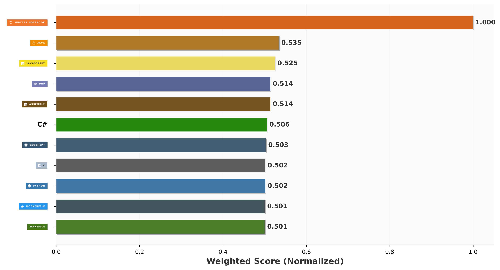

### Hello World!

## Languages
<!--
This profile uses GitHub Language Stats:
StefVuck/Github-Language-Stats@v1.2.0

To renew Token:

1. Create a Fine-grained Personal Access Token:
GitHub → Settings → Developer settings → Personal access tokens → Fine-grained tokens

2. Security:
Repository access: only select the repositories that should be analyzed
Metadata -> Read-Only

3. Store the token as a repository secret:
Name: STATS_TOKEN

4. The workflow should reference it as:
`${{ secrets.STATS_TOKEN }}`

5. Token expiration:
   When the PAT expires, the stats workflow will stop updating.
   Existing stats/images will remain in the repository; they simply become stale.
   Create a new fine-grained PAT with the same restrictions and replace
   the `STATS_TOKEN` secret. No README/workflow change should be necessary.

Last reviewed: 2026-10
-->

